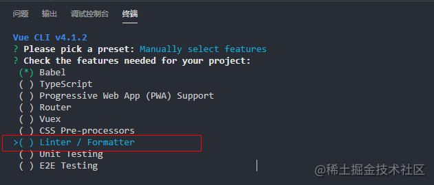
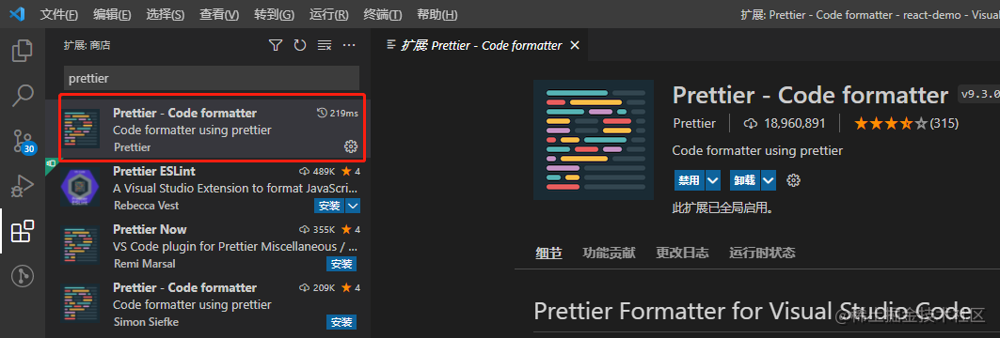

# 前端团队规范化

## 1

使用 vue-cli 脚手架创建项目时，**「不选择 Lint 选项」**。



在项目开发依赖中，加入 babel-eslint、eslint、eslint-plugin-vue、prettier、eslint-plugin-prettier、eslint-config-prettier 依赖，命令如下：

```bash
npm install babel-eslint     –d
```

```bash
npm install  eslint  –d
```


```
npm install  eslint-plugin-vue  –d
```


```
npm install  prettier  –d
```


```
npm install  eslint-plugin-prettier  –d
```


```
npm install  eslint-config-prettier  –d
```


开发时，保存文件，即可按 prettier 规则格式化文件，并自动修复可修复的 issue，不能自动修复的，请根据提示，手动修复。

提示：vscode 已设置保存时格式化，但有时并不会格式化文件。已保存的文件还存在报错的，请手动格式化，并修改相应问题后，再次保存。


## 2

vscode 编辑器配置

在项目根目录找到 .vscode 文件夹，如果没有新建一个，然后再新建 `settings.json` 文件，加入如下配置：

```json
{
  "editor.tabSize": 2,
  "editor.formatOnSave": true, // 保存时自动格式化
  "editor.wordWrap": "on",
  "vetur.format.defaultFormatter.html": "js-beautify-html", // 因为prettier不能格式化vue文件template  因此使用js-beautify-html格式化
  "vetur.format.defaultFormatterOptions":{
    "js-beautify-html":{
        "wrap_attributes":"auto"
    }
  },
  /* eslint的配置 */
  "eslint.enable": true,
  "eslint.run": "onSave",
  "eslint.options": {
    "extensions": [
     ".js",
     ".vue"
    ]
   },
   "editor.codeActionsOnSave": {
    "source.fixAll.eslint": true // 保存时自动修复
   },
   // 关闭 vscode 默认的检查工具
   "html.validate.scripts": false,
   "javascript.validate.enable": false,
   "eslint.alwaysShowStatus": true,
   "eslint.format.enable": true,
   "scss.lint.duplicateProperties": "error",
   "css.lint.duplicateProperties": "error",
   "less.lint.zeroUnits": "error",
   "eslint.validate": [ // 验证文件类型
    "javascript",
    "javascriptreact",
    "vue-html",
    "vue",
    "html"
   ]
}

```

## 3

**EsLint 安装与配置**

全局安装 EsLint

```
npm install -D eslint
```

vscode 插件市场搜索 eslint，下载并安装，如下图所示：


本项目基本规范是依托于 vue 官方的 eslint-plugin-vue。并使用 Prettier 格式化代码，使样式与规则保持一致。

在项目根目录新增 `.eslintrc.js` 文件，加入如下配置：

```js
module.exports = {
  root: true, // 当前配置为根配置，将不再从上级文件夹查找配置
  parserOptions: {
    parser: 'babel-eslint', // 采用 babel-eslint 作为语法解析器
    sourceType: 'module'  // 指定来源的类型，有两种script或module
  },
  env: {
    browser: true, // 设置为所需检查的代码是在浏览器环境运行的
    node: true, // 设置为所需检查的代码是nodejs环境运行的
    es6: true // 设置所需检查代码为es6语法书写
  },
  // 配置js全局变量，因为是uni-app，全局的uni是不需要引入的
  globals: {
    uni: 'readonly',
    wx: 'readonly',
  },
  extends: ['plugin:vue/recommended', 'eslint:recommended', 'plugin:prettier/recommended'], // 扩展使用 vue 检查规则和eslint推荐规则
  rules: {
    'prettier/prettier': 'error',
    'no-console': process.env.NODE_ENV === 'production' ? 'error' : 'off', // 只有开发环境可以使用console
    'no-debugger': process.env.NODE_ENV === 'production' ? 'error' : 'off', // 只有开发环境可以使用debugger
    'vue/attribute-hyphenation': 0, // 忽略属性连字
    'vue/max-attributes-per-line':[2, { singleline: 10, multiline: { max: 1, allowFirstLine: false } }], // 每行最大属性
    'vue/singleline-html-element-content-newline': 'off', // 单行html元素内容在新的一行
    'vue/multiline-html-element-content-newline': 'off', // 多行html元素内容在新的一行
    'vue/html-closing-bracket-newline': 'off', // html右括号在新的一行
    'vue/no-v-html': 'off', // 不使用v-html
    'vue/html-self-closing': 0, // 忽略html标签自闭合
    'accessor-pairs': 2, // 应同时设置setter和getter
    'arrow-spacing': [2, { before: true, after: true }], // 箭头间距
    'vue/require-default-prop': 0, // 不检查默认属性
    'vue/require-prop-types': 0, // 不检查默认类型
    'block-spacing': [2, 'always'], // 块间距
    'brace-style': [2, '1tbs', { allowSingleLine: true }], // 大括号样式允许单行
    'camelcase': [2, { properties: 'always' }], // 为属性强制执行驼峰命名
    'comma-dangle': [2, 'never'], // 逗号不使用悬挂
    'comma-spacing': [2, { before: false, after: true }], // 逗号间距
    'comma-style': [2, 'last'], //（默认）与数组元素，对象属性或变量声明在同一行之后和同一行需要逗号
    'constructor-super': 2,
    'consistent-this': [2, 'that'], // 强制this别名为that
    'curly': [2, 'multi-line'], // 当一个块只包含一条语句时，不允许省略花括号。
    'dot-location': [2, 'property'], //成员表达式中的点应与属性部分位于同一行
    'eol-last': 2, // 强制文件以换行符结束（LF）
    'eqeqeq': ['error', 'always', { null: 'ignore' }], // 强制使用全等
    'generator-star-spacing': [2, { before: true, after: true }], // 生成器中'*'两侧都要有间距
    'global-require': 1, // 所有调用require()都位于模块的顶层
    'indent': [2, 2, { SwitchCase: 2 }], // 缩进风格
    'key-spacing': [2, { beforeColon: false, afterColon: true }], // 强制在对象字面量属性中的键和值之间保持一致的间距
    'keyword-spacing': [2, { before: true, after: true }], // 关键字如if/function等的间距
    'new-cap': [2, { newIsCap: true, capIsNew: false }],// 允许在没有new操作符的情况下调用大写启动的函数;（默认）要求new使用大写启动函数调用所有操作符
    'new-parens': 2, // JavaScript通过new关键字调用函数时允许省略括号
    'no-array-constructor': 1, // 不允许使用Array构造函数。除非要指定生成数组的长度
    'no-class-assign': 2, // 不允许修改类声明的变量
    'no-const-assign': 2, // 不能修改使用const关键字声明的变量
    'no-control-regex': 0, // 不允许正则表达式中的控制字符
    'no-delete-var': 2, // 不允许在变量上使用delete操作符
    'no-dupe-args': 2, // 不允许在函数声明或表达式中使用重复的参数名称
    'no-dupe-class-members': 2, // 不允许在类成员中使用重复的参数名称
    'no-dupe-keys': 2, // 不允许在对象文字中使用重复键
    'no-duplicate-case': 2, // 不允许在switch语句的case子句中使用重复的测试表达式
    'no-empty-character-class': 2, // 不允许在正则表达式中使用空字符类
    'no-empty-pattern': 2, // 不允许空块语句
    'no-eval': 2, // 不允许使用eval
    'no-ex-assign': 2, // 不允许在catch子句中重新分配例外
    'no-extend-native': 2, // 不允许直接修改内建对象的原型
    'no-extra-boolean-cast': 2, // 禁止不必要的布尔转换
    'no-extra-parens': [2, 'functions'], // 仅在函数表达式附近禁止不必要的括号
    'no-fallthrough': 2, //消除一个案件无意中掉到另一个案件
    'no-floating-decimal': 2, //消除浮点小数点，并在数值有小数点但在其之前或之后缺少数字时发出警告
    'no-func-assign': 2, // 允许重新分配function声明
    'no-implied-eval': 2, // 消除隐含eval()
    'no-inner-declarations': [2, 'functions'], // 不允许function嵌套块中的声明
    'no-invalid-regexp': 2, // 不允许RegExp构造函数中的无效正则表达式字符串
    'no-irregular-whitespace': 2, // 捕获无效的空格
    'no-iterator': 2, // 消除阴影变量声明
    'no-label-var': 2, // 禁止创建与范围内的变量共享名称的标签
    'no-labels': [2, { allowLoop: false, allowSwitch: false }], // 消除 JavaScript 中使用带标签的语句
    'no-lone-blocks': 2, // 消除脚本顶层或其他块中不必要的和可能混淆的块
    'no-mixed-spaces-and-tabs': 2, // 不允许使用混合空格和制表符进行缩进
    'no-multi-spaces': 2, // 禁止在逻辑表达式，条件表达式，声明，数组元素，对象属性，序列和函数参数周围使用多个空格
    'no-multi-str': 2, // 防止使用多行字符串
    'no-multiple-empty-lines': [2, { max: 1 }], // 最多一个空行
    'no-native-reassign': 2, // 不允许修改只读全局变量
    'no-new-object': 2, // 不允许使用Object构造函数
    'no-new-require': 2, // 消除new require表达的使用
    'no-new-symbol': 2, // 防止Symbol与new 同时使用的意外错误
    'no-new-wrappers': 2, // 杜绝使用String，Number以及Boolean与new操作
    'no-obj-calls': 2, // 不允许调用Math，JSON和Reflect对象作为功能
    'no-octal': 2, // 不允许使用八进制文字
    'no-octal-escape': 2, // 不允许字符串文字中的八进制转义序列
    'no-path-concat': 2, // 防止 Node.js 中的目录路径字符串连接无效
    'no-redeclare': 2, // 消除在同一范围内具有多个声明的变量
    'no-regex-spaces': 2, // 在正则表达式文字中不允许有多个空格
    'no-return-assign': [2, 'except-parens'], // 消除return陈述中的任务，除非用括号括起来
    'no-self-assign': 2, // 消除自我分配
    'no-self-compare': 2, // 禁止比较变量与自身
    'no-sequences': 2, // 禁止使用逗号运算符
    'no-sparse-arrays': 2, // 不允许稀疏数组文字
    'no-this-before-super': 2, // 在呼call前标记this/super关键字super()
    'no-throw-literal': 2, // 不允许抛出不可能是Error对象的文字和其他表达式
    'no-trailing-spaces': 2, // 不允许在行尾添加尾随空白
    'no-undef': 2, // 任何对未声明的变量的引用都会导致错误
    'no-undef-init': 2, // 消除初始化为undefined的变量声明
    'no-underscore-dangle': 2, // 标识符不能以_开头或结尾
    'no-unexpected-multiline': 2, // 不允许混淆多行表达式
    'no-unmodified-loop-condition': 2, // 查找循环条件内的引用，然后检查这些引用的变量是否在循环中被修改
    'no-unneeded-ternary': [2, { defaultAssignment: false }], // 不允许将条件表达式作为默认的分配模式
    'no-unreachable': 2, // 不允许可达代码return，throw，continue，和break语句后面还有语句。
    'no-unsafe-finally': 2, // 不允许return，throw，break，和continue里面的语句finally块
    'no-unused-vars': [2, { vars: 'all', args: 'after-used' }],
    // 消除未使用的变量，函数和函数的参数
    // vars: 'all' 检查所有变量的使用情况，包括全局范围内的变量。这是默认设置。args: 'after-used' 只有最后一个参数必须使用。例如，这允许您为函数使用两个命名参数，并且只要您使用第二个参数，ESLint 就不会警告您第一个参数。这是默认设置。
    'no-useless-call': 2, // 标记使用情况，Function.prototype.call()并且Function.prototype.apply()可以用正常的函数调用来替代
    'no-useless-computed-key': 2, // 禁止不必要地使用计算属性键
    'no-useless-constructor': 2, // 在不改变类的工作方式的情况下安全地移除的类构造函数
    'no-useless-escape': 0, // 禁用不必要的转义字符
    'no-whitespace-before-property': 2, // 如果对象的属性位于同一行上，不允许围绕点或在开头括号之前留出空白
    'no-with': 2, // 禁用with
    'no-var': 2, // 禁用var
    'one-var': [2, { initialized: 'never' }], // 强制将变量声明为每个函数（对于var）或块（对于let和const）范围一起声明或单独声明。initialized: 'never' 每个作用域要求多个变量声明用于初始化变量
    'operator-linebreak': [2, 'after', { overrides: { '?': 'before', ':': 'before' } }], // 实施一致的换行
    'padded-blocks': [2, 'never'], // 在块内强制执行一致的空行填充
    'prefer-destructuring': ['error', { object: false, array: false }], // 此规则强制使用解构而不是通过成员表达式访问属性。
    'quotes': [2, 'single', { avoidEscape: true, allowTemplateLiterals: true }], // avoidEscape: true 允许字符串使用单引号或双引号，只要字符串包含必须以其他方式转义的引号 ;allowTemplateLiterals: true 允许字符串使用反引号
    'radix': 2, // parseInt必须指定第二个参数
    'semi': [2, 'never'], // 不使用分号
    'semi-spacing': [2, { before: false, after: true }], // 强制分号间隔
    'space-before-blocks': [2, 'always'], // 块必须至少有一个先前的空间
    'space-before-function-paren': [2, 'never'], // 在(参数后面不允许任何空格
    'space-in-parens': [2, 'never'], // 禁止或要求（或）左边的一个或多个空格
    'space-infix-ops': 2, // 强制二元运算符左右各有一个空格
    'space-unary-ops': [2, { words: true, nonwords: false }], // words: true 如：new，delete，typeof，void，yield 左右必须有空格 // nonwords: false 一元运算符，如：-，+，--，++，!，!!左右不能有空格
    'spaced-comment': [2, 'always', { markers: ['global', 'globals', 'eslint', 'eslint-disable', '*package', '!', ','] }], // 注释开始后，此规则将强制间距的一致性//或/*
    'template-curly-spacing': [2, 'never'], // 不允许大括号内的空格
    'use-isnan': 2, // 禁止比较时使用NaN，只能用isNaN()
    'valid-typeof': 2, // 必须使用合法的typeof的值
    'wrap-iife': [2, 'any'], // 立即执行函数表达式的小括号风格
    'yield-star-spacing': [2, 'both'], // 强制执行*周围 yield*表达式的间距，两侧都必须有空格
    'yoda': [2, 'never'],
    'prefer-const': 2, // 使用let关键字声明的变量，但在初始分配后从未重新分配变量，应改为const声明
    'object-curly-spacing': [2, 'always', { objectsInObjects: false }], // 不允许以对象元素开始和/或以对象元素结尾的对象的大括号内的间距
    'array-bracket-spacing': [2, 'never'] // 不允许数组括号内的空格
  }
}

```

## 4

**Prettier 安装与配置**

全局安装 Prettier

```
npm install -D prettier
```

vscode 插件市场搜索 prettier，下载并安装，如下图所示：




在项目根目录新建 `.prettierrc.json` 文件，加入如下配置：

```json
{
  "printWidth": 175, // 每行代码长度（默认175）
  "trailingComma": "none", // 在对象或数组最后一个元素后面是否加逗号
  "tabWidth": 2, // 每个tab相当于多少个空格（默认2）
  "useTabs": true, // 使用tab（制表符）缩进而非空格
  "semi": false, // 是否在行尾加分号
  "singleQuote": true, // 使用单引号代替双引号
  "arrowParens": "avoid", // (x) => {} 箭头函数参数只有一个时是否要有小括号。avoid：省略括号
  "bracketSpacing": true, // 在对象，数组括号与文字之间加空格 "{ foo: bar }"
  "proseWrap": "preserve", // 默认值。因为使用了一些折行敏感型的渲染器（如GitHub comment）而按照markdown文本样式进行折行
  "htmlWhitespaceSensitivity": "ignore", // HTML 文件空格敏感度
  "jsxBracketSameLine": true  // 将>多行JSX元素放在最后一行的末尾，而不是单独放在下一行
}
```


## 5

忽略校验的文件

在项目根目录新建 `.eslintignore` 文件，加入如下配置：

```
node_modules
src/assets
build
public
dist
```

